# Image Generation Log — Mrs. DoubtHire

Drag-queen luxury taxi service, Palm Springs CA. IMAGE FORGE MODE — branding proof of concept.
Phase 1: Logo concepts. All logos use Nano Banana Pro (text-critical brand foundation).

QA note: Logo phase uses Claude visual review only. The critical risk on flat signage/wordmark logos is text spelling (verified visually by Claude). Grok vision QA is reserved for the photorealistic vehicle + action scenes where it catches anatomy/clipping/physics artifacts.

---

### #1 — logo-1-neon-marquee.jpg (NB Pro, passed first try)
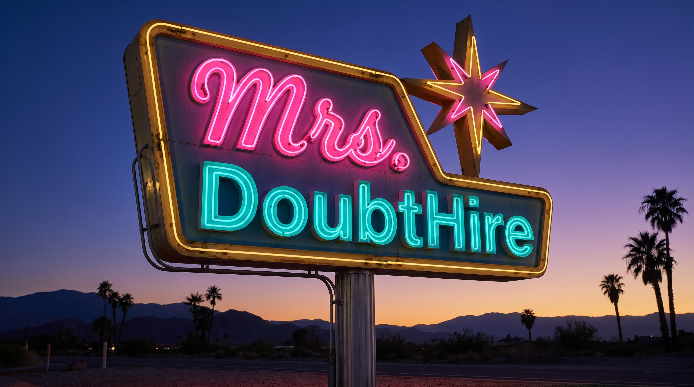
- **Timestamp**: 2026-05-28
- **Tier**: 2 | **API**: Gemini Nano Banana Pro @ 2K | **Cost**: $0.134
- **Slot**: Logo concept — "Desert Neon Marquee" direction (also doubles as ad key-art)
- **Prompt**: Palm Springs mid-century motel-sign neon emblem — "Mrs." in hot-pink cursive neon, "DoubtHire" in electric-teal channel letters, atomic starburst, twilight desert sky + palms, 16:9.
- **Claude Review**: Use Case 9/10 | Prompt Accuracy 10/10
- **Attempts**: 1/2
- **Status**: ✓ Used — text "Mrs. DoubtHire" rendered perfectly
- **Notes**: Strongest as advertising hero / key-art. It's a scene-sign, not a scalable vector mark.

---

### #2 — logo-2-lips-lashes-badge.jpg (NB Pro, passed first try)
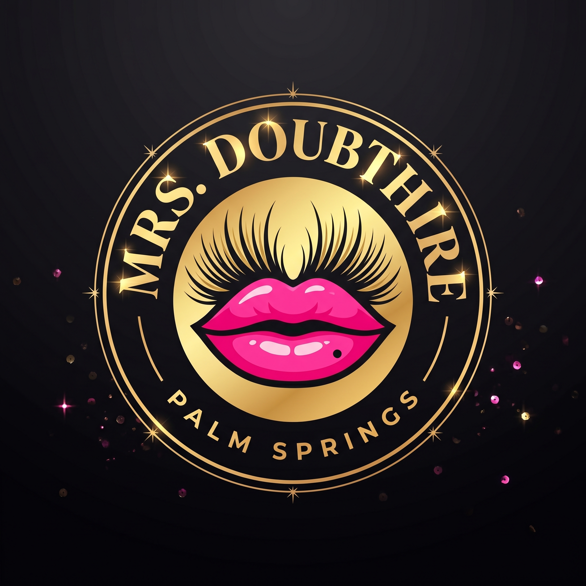
- **Timestamp**: 2026-05-28
- **Tier**: 2 | **API**: Gemini Nano Banana Pro @ 2K | **Cost**: $0.134
- **Slot**: Logo concept — "Lips & Lashes Badge" direction (car-door decal / app icon ready)
- **Prompt**: Circular gold-ring badge, glossy hot-pink lips under gold false lashes, "MRS. DOUBTHIRE" curved top + "PALM SPRINGS" curved bottom, matte black, sequin sparkle, 1:1.
- **Claude Review**: Use Case 9/10 | Prompt Accuracy 9/10
- **Attempts**: 1/2
- **Status**: ✓ Used — text correct
- **Notes**: Most versatile mark — scales to app icon, decal, merch, social avatar. Recommended primary.

---

### #3 — logo-3-checkered-taxi.jpg (NB Pro, passed first try)
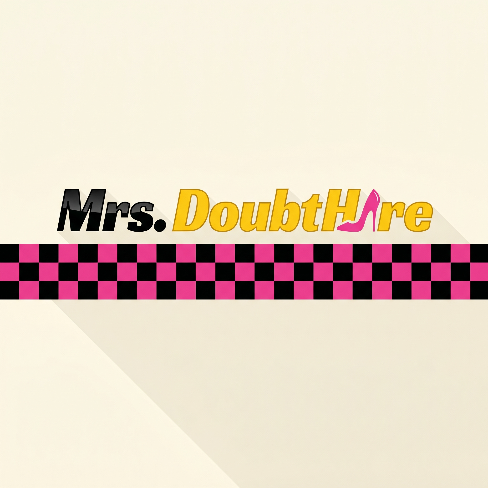
- **Timestamp**: 2026-05-28
- **Tier**: 2 | **API**: Gemini Nano Banana Pro @ 2K | **Cost**: $0.134
- **Slot**: Logo concept — "Checkered Drag Taxi" direction
- **Prompt**: Taxi-meets-glam — hot-pink/black checker stripe, "Mrs." black + "DoubtHire" taxi-yellow italic, pink stiletto replacing the "i" in Hire, cream bg + long shadow, 1:1.
- **Claude Review**: Use Case 8/10 | Prompt Accuracy 9/10
- **Attempts**: 1/2
- **Status**: ✓ Used — text correct, stiletto-as-i reads cleanly
- **Notes**: Most transport-forward. Reads slightly flat/corporate vs the others.

---

### #4 — logo-4-midcentury-script.jpg (NB Pro, passed first try)
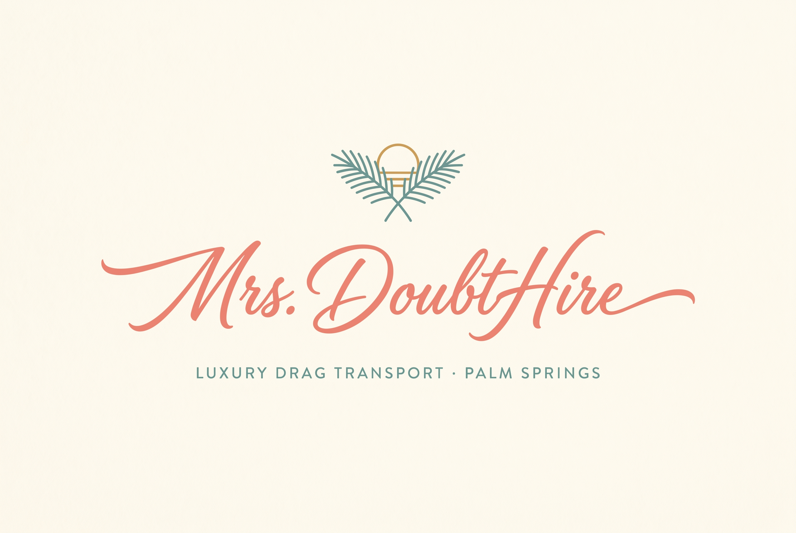
- **Timestamp**: 2026-05-28
- **Tier**: 2 | **API**: Gemini Nano Banana Pro @ 2K | **Cost**: $0.134
- **Slot**: Logo concept — "Mid-Century Script" direction
- **Prompt**: Coral cursive "Mrs. DoubtHire", teal "LUXURY DRAG TRANSPORT · PALM SPRINGS", crossed palm fronds + setting-sun line icon, cream bg, 3:2.
- **Claude Review**: Use Case 9/10 | Prompt Accuracy 10/10
- **Attempts**: 1/2
- **Status**: ✓ Used — text correct
- **Notes**: Most upscale/boutique. Pairs well as a secondary wordmark beneath the badge.

---

## Phase 1 Cost (Logos): $0.536 — Gemini Nano Banana Pro × 4

---

## Phase 2 — Vehicle Fleet (one palette each, unified branding)

### #5 — vehicle-1-van-pink.jpg (NB Pro, passed first try)
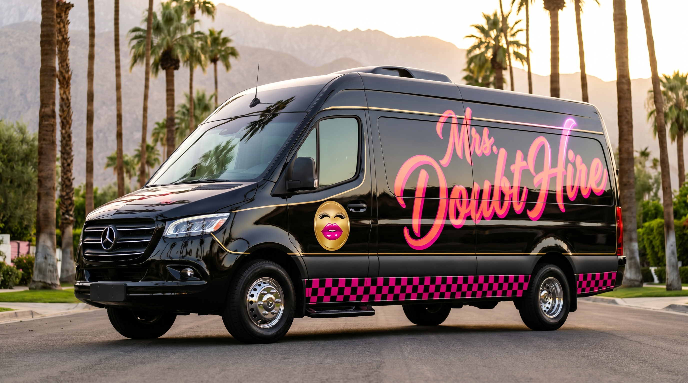
- **Timestamp**: 2026-05-28
- **Tier**: 2 | **API**: Gemini Nano Banana Pro @ 2K | **Cost**: $0.134
- **Slot**: Fleet vehicle — Sprinter party van (bachelorette workhorse)
- **Palette**: Hot pink + black + gold
- **Claude Review**: Use Case 9/10 | Prompt Accuracy 8/10
- **Status**: ✓ Used — "Mrs. DoubtHire" script correct; door badge rendered as a cute kiss-face emblem (on-brand)
- **Notes**: Clean wheels/proportions, no artifacts — Grok QA skipped.

### #6 — vehicle-2-convertible-coral.jpg (NB Pro, passed first try)
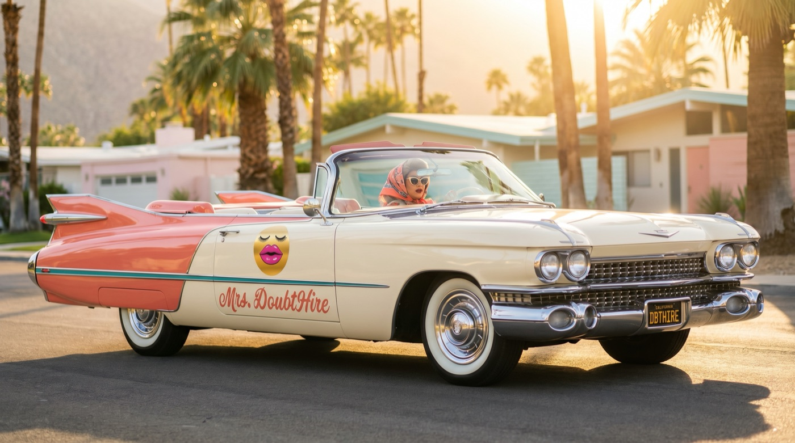
- **Timestamp**: 2026-05-28
- **Tier**: 2 | **API**: Gemini Nano Banana Pro @ 2K | **Cost**: $0.134
- **Slot**: Fleet vehicle — vintage 1959 convertible (hero glam, top down)
- **Palette**: Coral + teal + cream
- **Claude Review**: Use Case 10/10 | Prompt Accuracy 9/10
- **Status**: ✓ Used — "Mrs. DoubtHire" script + "DBTHIRE" plate correct, glam driver in seat
- **Notes**: Strongest single hero shot. Pastel mid-century PS houses, golden-hour flare. No artifacts.

### #7 — vehicle-3-suv-neon.jpg (NB Pro, passed first try)
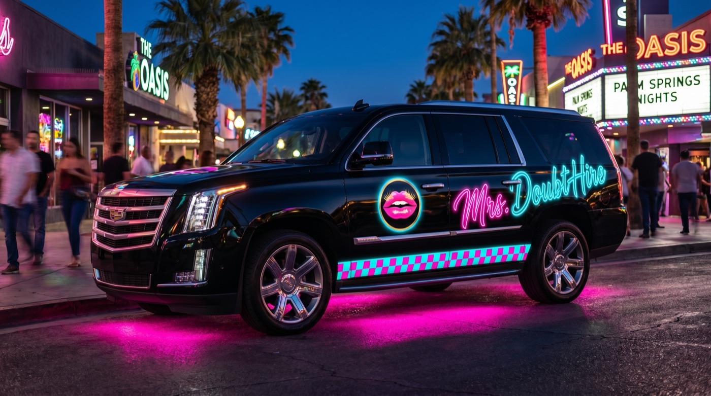
- **Timestamp**: 2026-05-28
- **Tier**: 2 | **API**: Gemini Nano Banana Pro @ 2K | **Cost**: $0.134
- **Slot**: Fleet vehicle — blacked-out luxury SUV (nightlife)
- **Palette**: Neon pink + electric teal + twilight
- **Claude Review**: Use Case 10/10 | Prompt Accuracy 9/10
- **Status**: ✓ Used — neon "Mrs. DoubtHire" script correct, pink underglow, nightclub bokeh
- **Notes**: Best nightlife/club-arrival energy. No artifacts.

## Phase 2 Cost (Fleet): $0.402 — Gemini Nano Banana Pro × 3

---

## Phase 2 Running Total: $0.938 / $5.00 cap

---

## Phase 3 — Promotional Action Scenes (phases of the night)

### #8 — scene-1-pickup.jpg (Grok, passed first try)

- **Timestamp**: 2026-05-28 | **Tier**: 1 | **API**: Grok Standard 2K | **Cost**: $0.02
- **Slot**: Phase 1 of night — golden-hour pickup, queen greeting bachelorette crew at a mid-century house
- **Claude Review**: Use Case 9/10 | Prompt Accuracy 8/10 (van wrap text Grok-soft, expected)
- **Status**: ✓ Used — clean hands/faces, "Bride" sash correct

### #9 — scene-2-cruising.jpg (Grok, passed first try)

- **Timestamp**: 2026-05-28 | **Tier**: 1 | **API**: Grok Standard 2K | **Cost**: $0.02
- **Slot**: Phase 2 — cruising the convertible at dusk, boas flying
- **Claude Review**: Use Case 10/10 | Prompt Accuracy 9/10
- **Status**: ✓ Used — strongest motion/hero energy, "BRIDE" sash correct

### #10 — scene-3-club-arrival.jpg (Grok, passed first try)

- **Timestamp**: 2026-05-28 | **Tier**: 1 | **API**: Grok Standard 2K | **Cost**: $0.02
- **Slot**: Phase 3 — night club arrival, queen escorting bride from the SUV
- **Claude Review**: Use Case 9/10 | Prompt Accuracy 8/10
- **Status**: ✓ Used — Grok auto-lettered the SUV "Luxe Limo & Party" instead of our brand (text limitation); neon sign "PALM SPRINGS AFTER DARK" rendered great

### #11 — scene-4-afterparty.jpg (Grok → NB2, accepted on attempt 2)
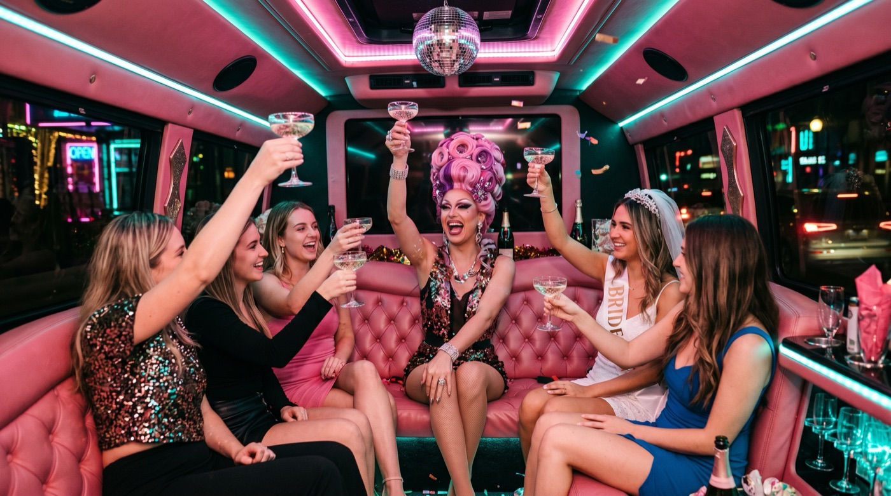
- **Timestamp**: 2026-05-28
- **Attempt 1**: Grok Standard 2K — $0.02 — REJECTED. Grok vision QA: Technical 6/10. Fused fingers, 6-fingered hand, merged glass stems, floating glass, extra arm segment in the dense central toast cluster. Archived as `scene-4-afterparty-attempt1-rejected.jpg`.
- **Attempt 2**: Gemini Nano Banana 2 @ 2K — $0.101 — restaged toast with separated hands/glasses
- **Slot**: Phase 4 — late-night van after-party interior
- **Claude Review (attempt 2)**: Use Case 9/10 | Prompt Accuracy 9/10
- **Attempts**: 2/2 (Grok → NB2)
- **Status**: ✓ Used — clean separated hands, disco ball, pink/teal LED, "BRIDE" sash
- **QA spend**: 1 Grok vision QA call (~$0.02 est)

## Phase 3 Cost (Scenes): $0.181 — Grok × 4 ($0.08) + NB2 × 1 ($0.101)

---

## Phase 3 Running Total: ~$1.14 / $5.00 cap

---

## Phase 4 — Brand Collateral (campaign line: "HIRE THE MRS.")

### #12 — ad-1-instagram-poster.jpg (NB Pro, passed first try)
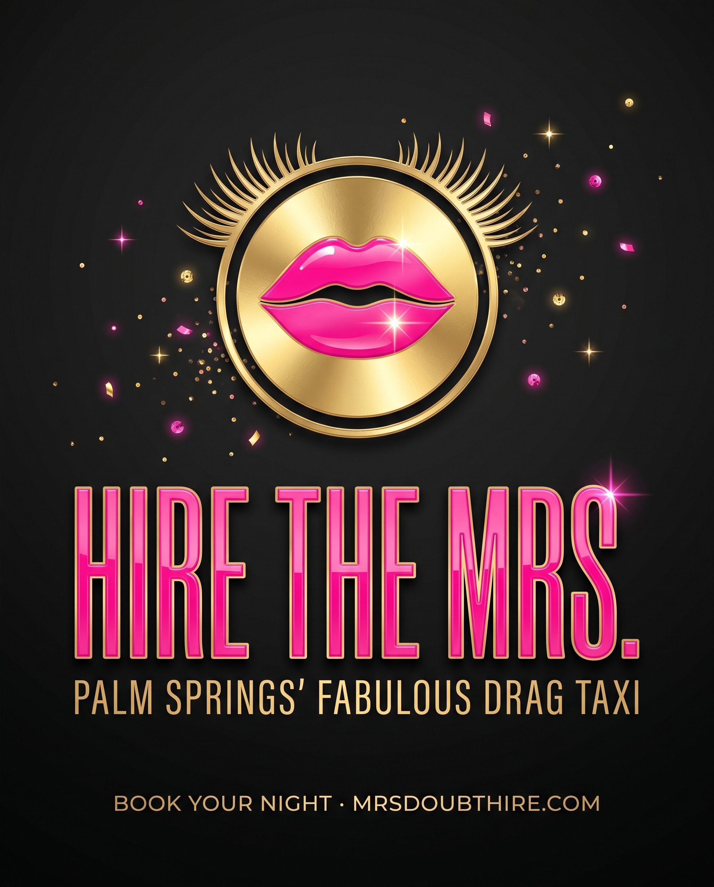
- **Timestamp**: 2026-05-28 | **Tier**: 2 | **API**: NB Pro @ 2K | **Cost**: $0.134
- **Slot**: Instagram ad poster (4:5)
- **Claude Review**: Use Case 10/10 | Prompt Accuracy 10/10
- **Status**: ✓ Used — "HIRE THE MRS." / "PALM SPRINGS' FABULOUS DRAG TAXI" / booking line all correct

### #13 — ad-2-packages-card.jpg (NB Pro gen → NB Pro edit, accepted on attempt 2)
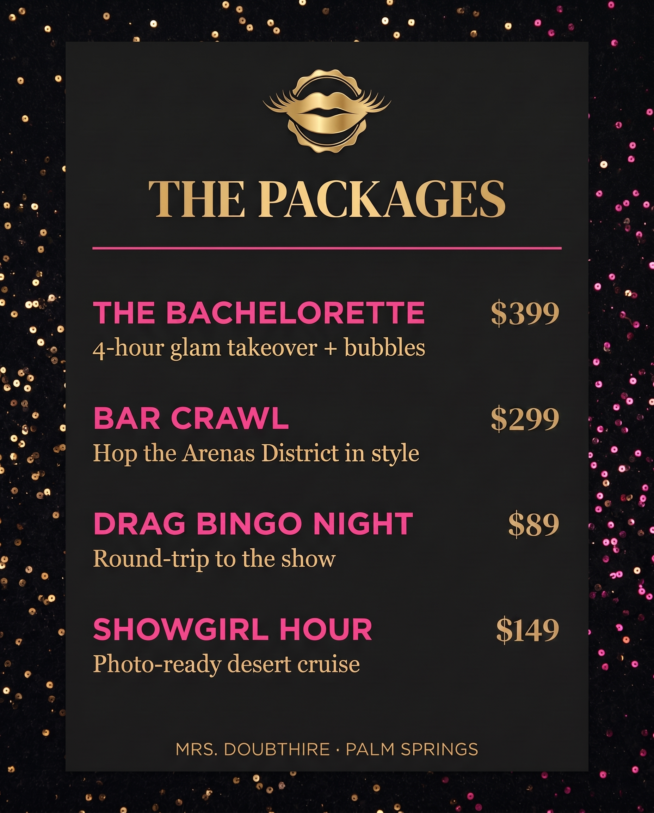
- **Timestamp**: 2026-05-28
- **Attempt 1**: NB Pro @ 2K — $0.134 — layout/names/descriptors correct but prices garbled ($20/$50/$50/$50). Archived `ad-2-packages-card-attempt1-rejected.jpg`.
- **Attempt 2**: NB Pro edit @ 2K — $0.134 — surgical price fix ("Change the four prices..."), succeeded
- **Slot**: Service packages menu card (4:5)
- **Claude Review (v2)**: Use Case 10/10 | Prompt Accuracy 10/10
- **Status**: ✓ Used — prices now $399 / $299 / $89 / $149
- **Note**: Prices are PLACEHOLDER for the proof of concept — confirm real rates before any client use.

### #14 — ad-3-business-card.jpg (NB Pro, passed first try)
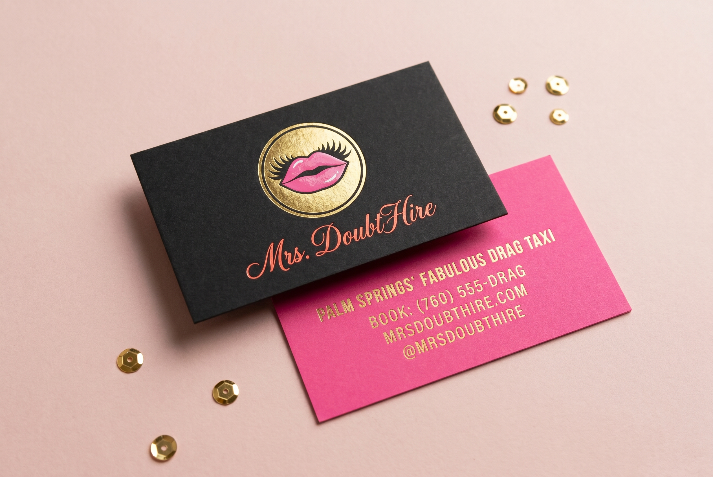
- **Timestamp**: 2026-05-28 | **Tier**: 2 | **API**: NB Pro @ 2K | **Cost**: $0.134
- **Slot**: Business card front/back flat-lay mockup (3:2)
- **Claude Review**: Use Case 10/10 | Prompt Accuracy 10/10
- **Status**: ✓ Used — badge + script front; back text (760) 555-DRAG / MRSDOUBTHIRE.COM / @MRSDOUBTHIRE all correct
- **Note**: Phone (760) 555-DRAG and handle are PLACEHOLDER.

### #15 — ad-4-merch.jpg (NB Pro, passed first try)
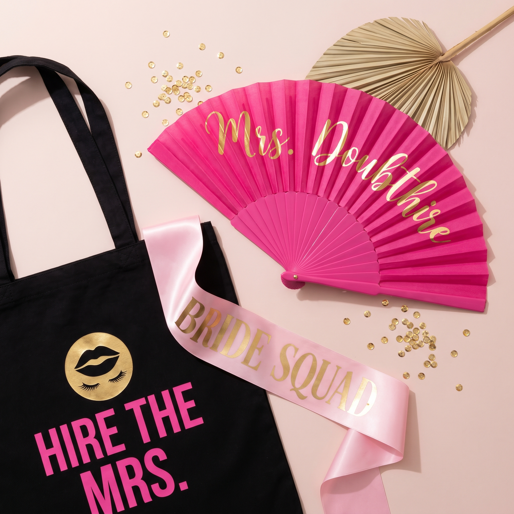
- **Timestamp**: 2026-05-28 | **Tier**: 2 | **API**: NB Pro @ 2K | **Cost**: $0.134
- **Slot**: Bachelorette merch flat-lay — fan, tote, sash (1:1)
- **Claude Review**: Use Case 10/10 | Prompt Accuracy 9/10 (fan cursive "h" slightly ambiguous)
- **Status**: ✓ Used — tote "HIRE THE MRS." + badge, sash "BRIDE SQUAD" correct

## Phase 4 Cost (Collateral): $0.536 — NB Pro × 4 (incl. 1 edit)

---

## FINAL RUNNING TOTAL: ~$1.68 / $5.00 cap
- Gemini Nano Banana Pro × 11 (incl. 1 edit) = $1.474
- Gemini Nano Banana 2 × 1 = $0.101
- Grok Standard × 5 = $0.10
- Grok vision QA × 1 ≈ $0.02

**15 keeper images + 2 archived rejects. Well under the $5 campaign cap.**

---

## Phase 5 — Dedicated Hero (replacing the busy cruise-scene hero)

Zack flagged the original hero (`scene-2-cruising.jpg`) as too busy/centered with the headline landing on the subject's face. Forged purpose-built heroes with deliberate negative space for the headline.

### #16 — hero-a-goldenhour-clean.jpg (NB Pro gen → NB Pro edit) ⭐ LIVE HERO
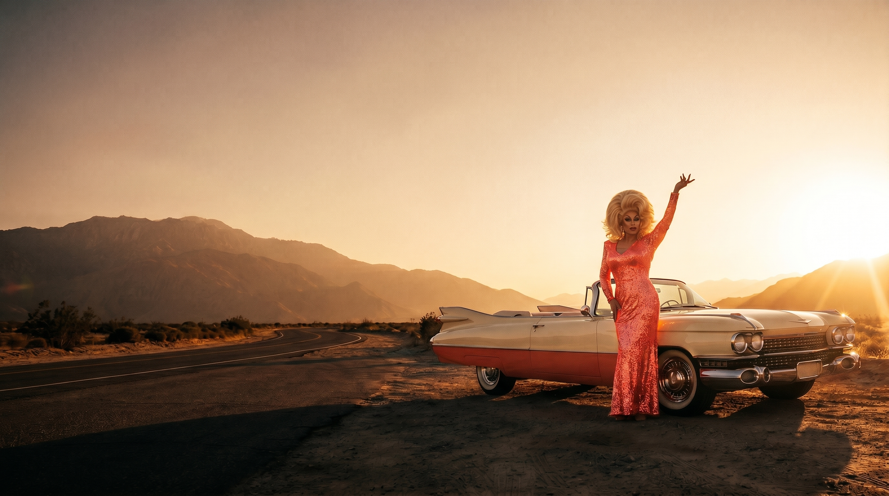
- **Timestamp**: 2026-05-28
- **Attempt 1 (gen)**: NB Pro @ 2K — $0.134 — `hero-a-goldenhour.jpg`. Editorial wide desert shot, subject right-third, big sky negative space. Flaw: NB stamped "DIVA CAB" on the car door.
- **Attempt 2 (edit)**: NB Pro edit @ 2K — $0.134 — "Remove the small logo and text on the car door..." → clean door, composition preserved.
- **Slot**: Landing-page hero (also re-cropped to the 1200×630 OG image)
- **Claude Review**: Use Case 10/10 | Prompt Accuracy 10/10
- **Status**: ✓ LIVE — wired into index.html hero, bottom-aligned poster layout, object-position 68% for mobile crop

### #17 — hero-b-neonnight.jpg (NB Pro, alternate)
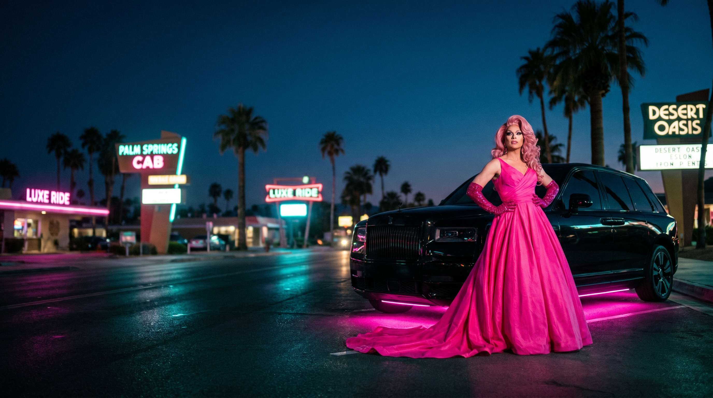
- **Timestamp**: 2026-05-28 | **Tier**: 2 | **API**: NB Pro @ 2K | **Cost**: $0.134
- **Slot**: Alternate hero — neon-night ballgown by the SUV
- **Claude Review**: Use Case 9/10 | Prompt Accuracy 9/10
- **Status**: ◐ Bench — strong alternate; background neon signs are generic street set-dressing. Available if Zack prefers the night mood.

## Phase 5 Cost (Hero): $0.402 — NB Pro × 3 (gen A + edit A + gen B)

---

## REVISED RUNNING TOTAL: ~$2.08 / $5.00 cap
